# swe-dashboard
Software Engineer Metrics

## Configuration

* scm-gitlab-baseurl
* scm-gitlab-token
* victoriametrics-importurl
* check-interval

## Runing

Download binary from releases

> ./swed --scm-gitlab-baseurl=https://your-domain-name/api/v4 --scm-gitlab-token=TOKEN --victoriametrics-importurl=http://localhost:8428/api/v1/import/prometheus --check-interval=1h

#### Docker

```bash
docker run --rm --name=swed c1982/swed \
--scm-gitlab-baseurl=https://your-domain-name/api/v4 \
--scm-gitlab-token=TOKEN \
--victoriametrics-importurl=http://localhost:8428/api/v1/import/prometheus \
--check-interval=1h
```

#### Easy Setup

Note: Firstly enter your gitlab variables in config.env file

```bash
git clone https://github.com/c1982/swe-dashboard.git
cd swe-dashboard/docker
docker-compose --env-file ./config.env up
```

## Metrics

* Cycletime
* Time to Open
* Time to Review
* Time to Approve
* Time to Merge
* Friday MRs/PRs
* Long-Running MRs/PRs
* MRs/PRs Comments LeaderBoard
* MRs/PRs Participants LeaderBoard
* MRs/PRs Rates
* MRs/PRs Sizes
* MRs/PRs Throughput
* Self-Merging MRs/PRs
* Developer Turnover Rate
* Unreviewed MRs/PRs
* Review Coverage
* Defect Rate
* MRs/PRs Success Rate

## Supported SCM

* Gitlab
* GitHub (not implemented yet)

## Supported TimeSeries DB

* Victoriametrics


### MRs/PRs Cycle Times

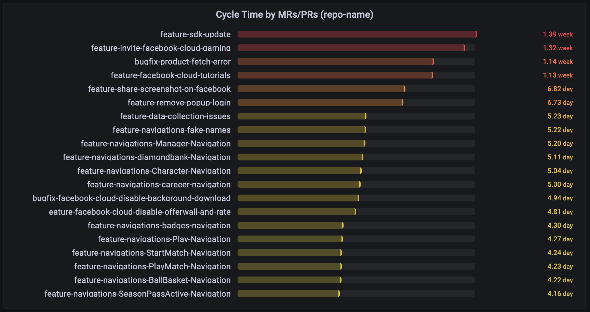

### MRs/PRs Times
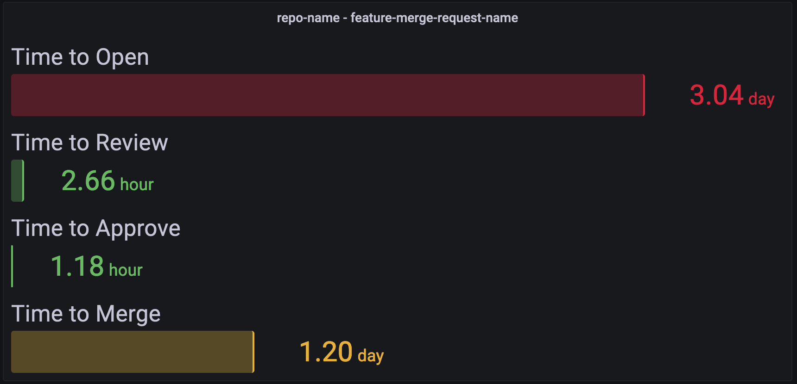

### Single Cycle Times
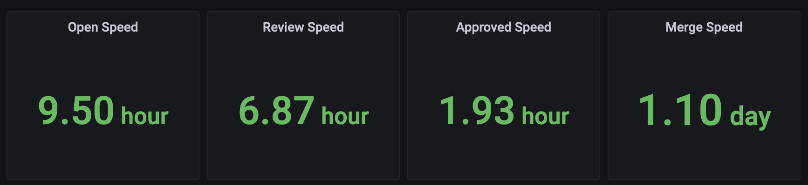

### Long-Running MRs/PRs

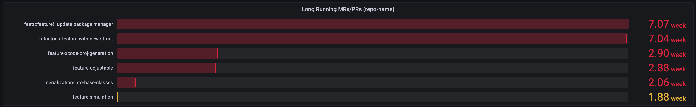

### MRs/PRs Size Counts

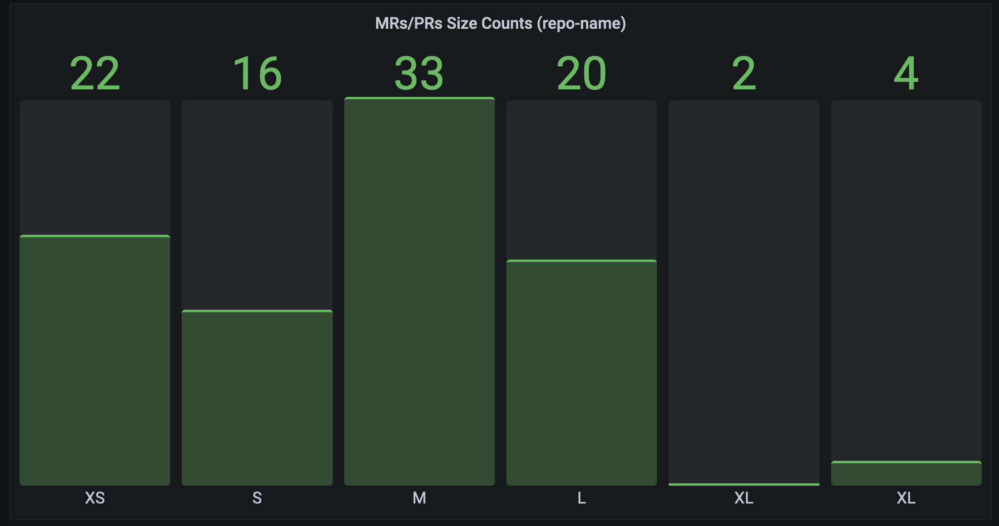

### Friday MRs/PRs

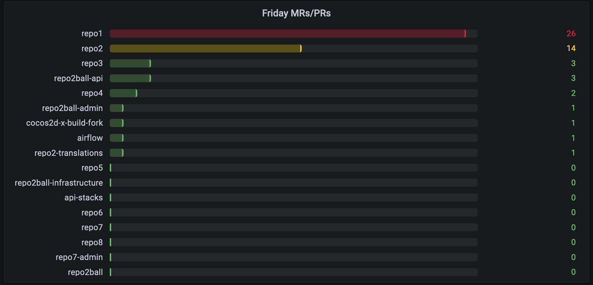

### Unreviewed MRs/PRs

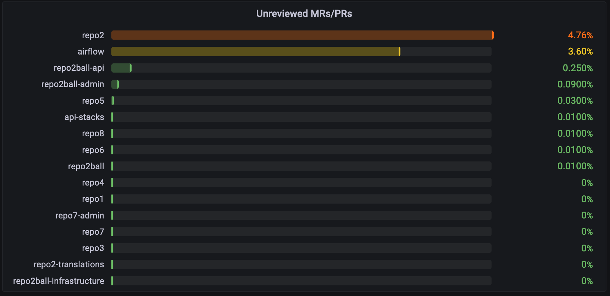

### MRs/PRs Comments


### MRs/PRs Rates

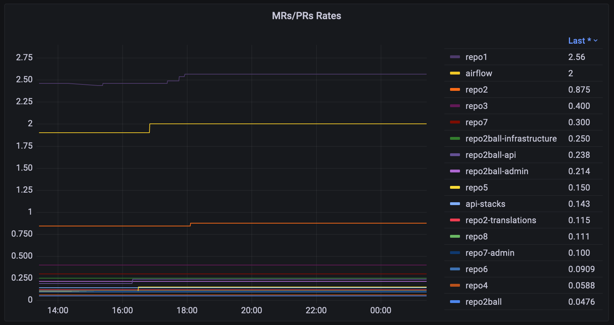

### MRs/PRs Participants

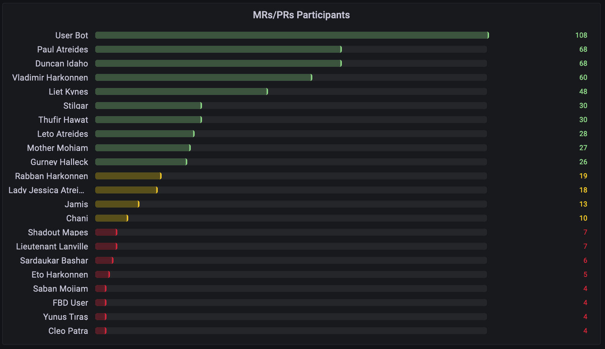

### Self-Merging Users

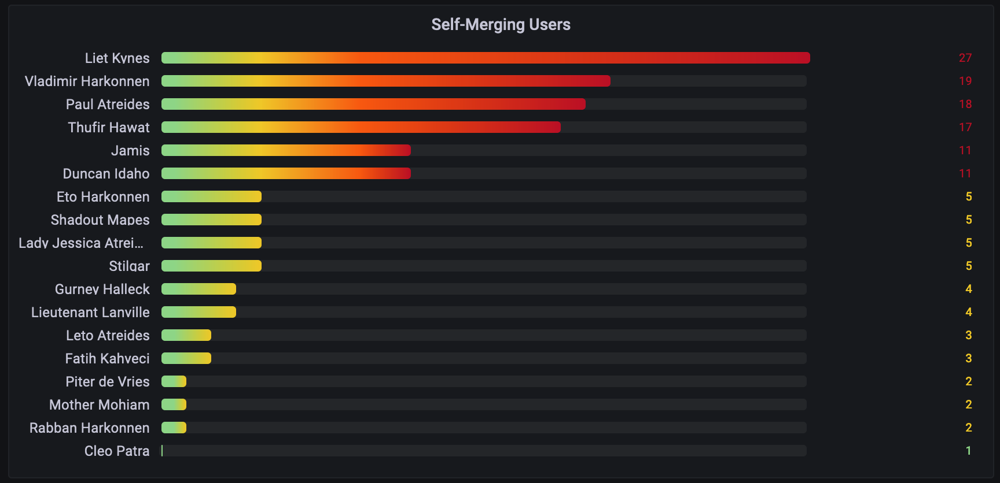

### Repositories Cycle Time

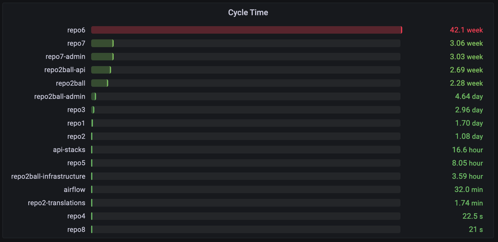

### Repositories Time to Open

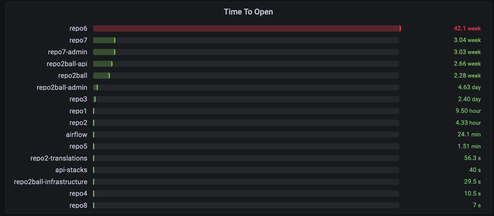

### Repositories Time to Review

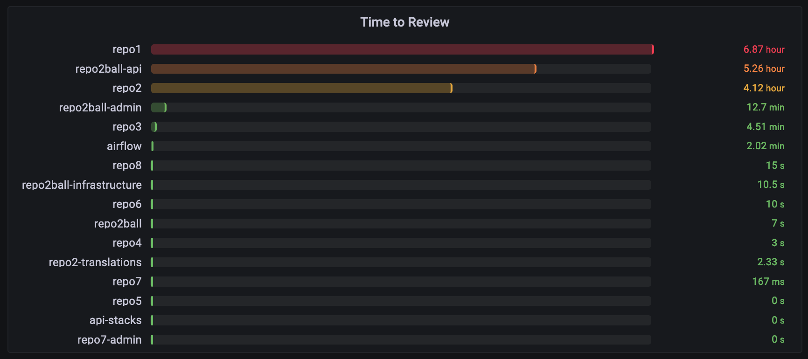

### Repositories Time to Approve

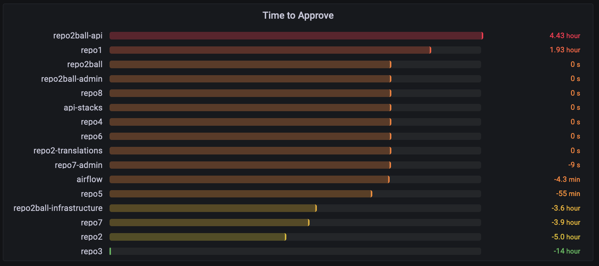

### Repositories Time to Merge

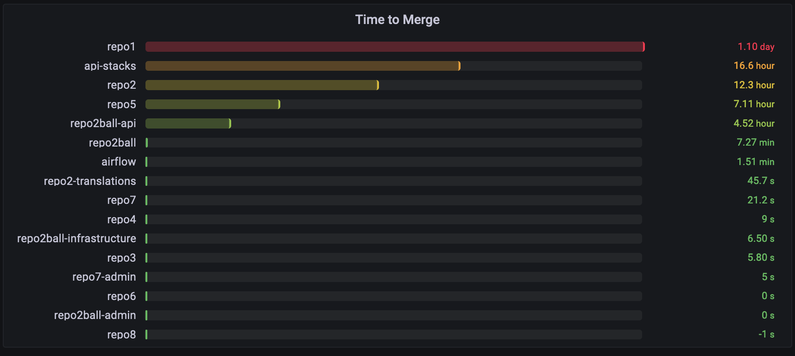

### Defect Rate

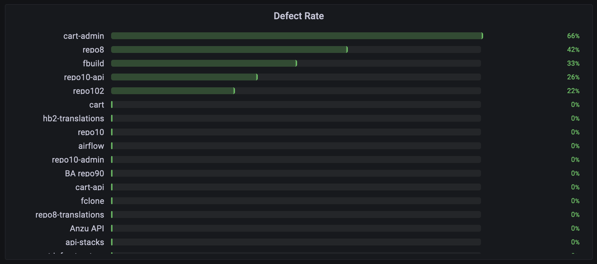

### User Defect Rate

TODO: image

### MRs/PRs Success Rate

TODO: image