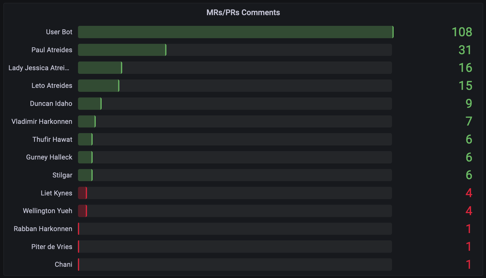

# swe-dashboard
Software Engineer Metrics

## Configuration

* scm-gitlab-baseurl
* scm-gitlab-token
* victoriametrics-importurl
* check-interval

## Runing

Download binary from [releases](https://github.com/c1982/swe-dashboard/releases)

```bash
./swed --scm-gitlab-baseurl=https://your-domain-name/api/v4 \
--scm-gitlab-token=TOKEN \
--victoriametrics-importurl=http://localhost:8428/api/v1/import/prometheus \
--check-interval=1h
```

#### Docker

```bash
docker run --rm --name=swed c1982/swed \
--scm-gitlab-baseurl=https://your-domain-name/api/v4 \
--scm-gitlab-token=TOKEN \
--victoriametrics-importurl=http://localhost:8428/api/v1/import/prometheus \
--check-interval=1h
```

#### Easy Setup

Note: Firstly enter your gitlab variables in config.env file

```bash
git clone https://github.com/c1982/swe-dashboard.git
cd swe-dashboard/docker
docker-compose --env-file ./config.env up
```
#### Daemon

If you want to run the daemon as a service, you can use the following commands:

0. edit [.swed.config](./daemon/.swed.config) file for your system
1. mkdir /opt/swed
2. cd /opt/swed
3. copy .swed-config /opt/swed
4. copy swed binary to /opt/swed
5. `chmod +x /opt/swed/swed`
6. copy [.swed.config](./daemon/swed.service) to /etc/systemd/system
7. `systemctl enable swed.service`
8. `systemctl start swed.service`
9. watch for errors `journalctl -u swed.service -f`

## Metrics

* Cycletime
* Time to Open
* Time to Review
* Time to Approve
* Time to Merge
* Friday MRs/PRs
* Long-Running MRs/PRs
* MRs/PRs Comments LeaderBoard
* MRs/PRs Participants LeaderBoard
* MRs/PRs Rates
* MRs/PRs Sizes
* MRs/PRs Throughput
* Self-Merging MRs/PRs
* Developer Turnover Rate
* Unreviewed MRs/PRs
* Review Coverage
* Defect Rate
* MRs/PRs Success Rate
* Active Contributors
* Additin/Deletion Lines of Code

## Supported SCM

* Gitlab Community Edition
* GitHub (implemented, not tested)

## Supported TimeSeries DB

* Victoriametrics

### Grafana Dashboards

* [SWE Dashboard - Metrics](./grafana/swe-dashboard-metrics.json)
* [SWE Dashboard - Repository](./grafana/swe-dashboard-repository.json)

### Metrics Dashboard:


### MRs/PRs Cycle Times


### MRs/PRs Times


### Single Cycle Times


### Long-Running MRs/PRs


### MRs/PRs Size Counts


### Friday MRs/PRs


### Unreviewed MRs/PRs


### MRs/PRs Comments



### MRs/PRs Rates


### MRs/PRs Participants


### Self-Merging Users


### Repositories Cycle Time


### Repositories Time to Open


### Repositories Time to Review


### Repositories Time to Approve


### Repositories Time to Merge


### Defect Rate


### User Defect Rate

TODO: image

### MRs/PRs Success Rate

TODO: image

### Active Contributors


